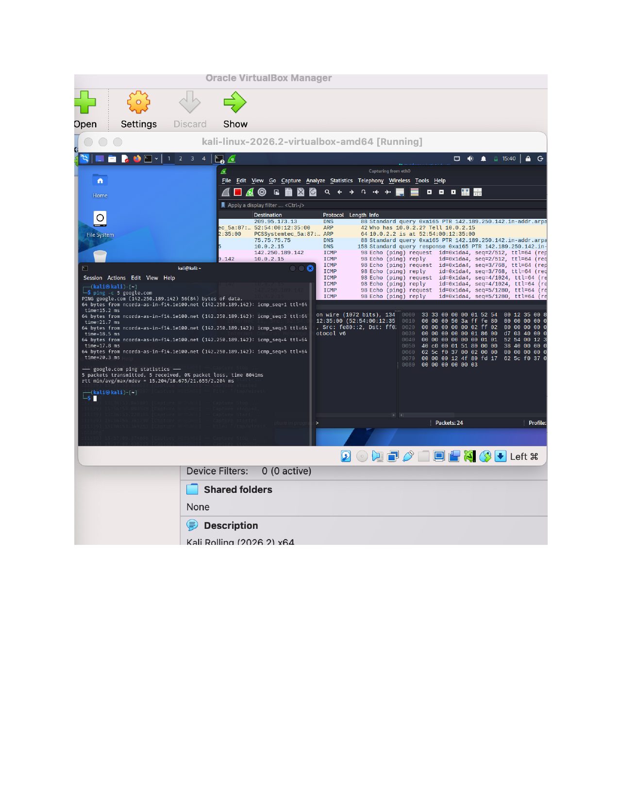
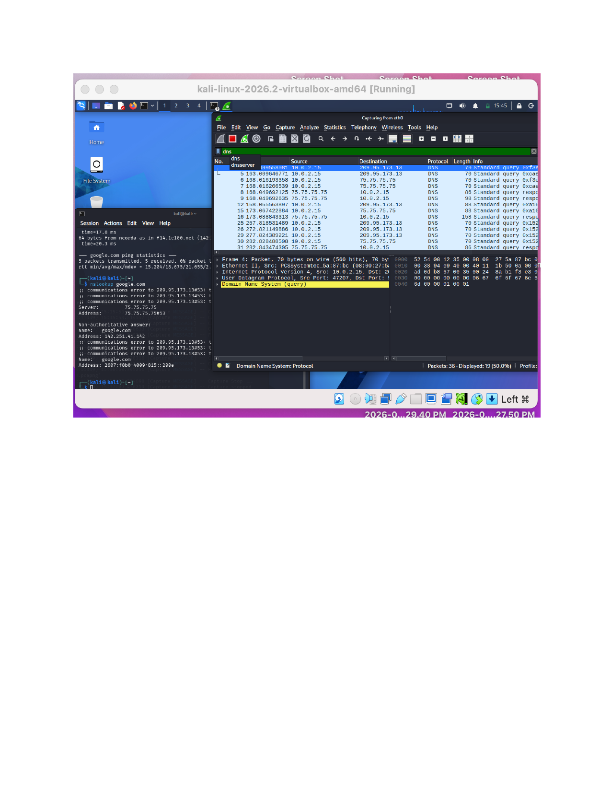

# Home SOC Lab

A self-hosted Security Operations Center (SOC) lab built to practice core network security, monitoring, and packet analysis skills using a virtualized Kali Linux environment.

## 🖥️ Lab Environment

| Component | Details |
|---|---|
| Hypervisor | Oracle VirtualBox |
| Analyst VM | Kali Linux 2026.2 (amd64) |
| Network Interface | `eth0` |
| Local IP | `10.0.2.15` |
| Tools Used | Wireshark, Nmap, `ping`, `nslookup` |

## 🎯 Objectives

This lab was built to get hands-on practice with:
- Capturing and analyzing live network traffic
- Understanding DNS resolution and query behavior
- Performing basic host/port discovery
- Reading raw packet data (hex/ASCII) for protocol-level analysis
- Saving and managing packet captures (`.pcapng`) for later review

## 🔍 Exercises

### 1. Initial Setup & Connectivity Testing (ICMP)

**What I did:** Set up the Kali VM in VirtualBox with a working network connection, started a live Wireshark capture on `eth0`, and ran `ping -c 5 google.com` to test outbound connectivity.

**What it showed:** 5/5 packets received, 0% loss, round-trip times of ~15–20ms. In Wireshark, the corresponding traffic appears in order: a DNS query resolving `google.com`, a burst of ICMP echo request/reply pairs, and a PTR (reverse DNS) lookup on the resolved IP.

**Takeaway:** Confirms the full chain behind a simple `ping` — hostname resolution via DNS, then ICMP echo to the resolved IP, plus a separate reverse DNS lookup. Correlating CLI output with the actual packets on the wire (rather than just trusting the terminal) is the core SOC analyst skill being practiced here.

### 2. DNS Query Analysis

**What I did:** Ran `nslookup google.com` to manually trigger a DNS resolution, then filtered the Wireshark capture to `dns` only to isolate it from the rest of the traffic.

**What it showed:** `nslookup` returned both IPv4 and IPv6 addresses via my configured resolver. The filtered Wireshark view lines up — repeated standard DNS queries/responses between the VM (`10.0.2.15`) and the resolver (`75.75.75.75`), plus the raw Ethernet/IP/UDP header breakdown for a selected packet.

**Takeaway:** A single DNS "lookup" is actually multiple queries (A, AAAA, PTR). Filtering to `dns` in Wireshark is a basic but essential skill for cutting through noise in a busy capture.

### 3. Port Scanning & Automated Traffic Generation

**What I did:** Ran `nmap` against `localhost` to enumerate open ports/services. Also ran a bash loop (`for i in {1..20}; do ping -c 1 google.com; done`) to generate a larger traffic sample, and saved the capture session as a `.pcapng` file.

**What it showed:** All 1000 scanned ports on localhost came back closed (expected — no exposed services), scan completed in under a second. The loop generated 20 individual ping results, and the capture log confirmed the Wireshark session started, recorded, and stopped/saved correctly.

**Takeaway:** Practiced both host/port discovery with Nmap and generating controlled traffic to analyze rather than relying on random background noise. Saving captures as `.pcapng` mirrors how a SOC analyst preserves evidence for a case file.

### 4. Full Capture Review

**What I did:** Reviewed the complete unfiltered capture after stopping the recording, looking at the mix of traffic generated across the whole session.

**What it showed:** A realistic mix of ARP (local address resolution), DNS, and ICMP traffic interleaved in the order it actually occurred, plus a full field-by-field breakdown (Ethernet, IP, UDP headers) for a selected packet.

**Takeaway:** Being able to look at an unfiltered capture and mentally sort traffic by protocol and purpose is foundational for spotting anomalies later — e.g., unexpected ARP activity, DNS to a suspicious domain, or ICMP used for tunneling.

## 🧠 Lessons Learned

- DNS resolution triggers more traffic than expected (forward + reverse lookups)
- Wireshark display filters are essential for isolating relevant traffic in a busy capture
- Nmap on localhost is a safe way to learn scan syntax before scanning other hosts
- Saving captures (`.pcapng`) is a habit worth building early for repeatable analysis
